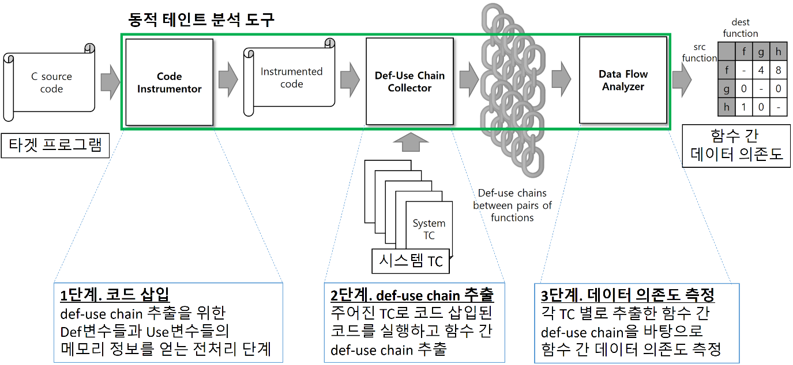

# dta_c
Dynamic Taint Analysis for C program

The tool dynamically measures data dependencies between functions in a target program using dynamic taint analysis.

Input: target C program, system test cases

Output: measured data dependencies between functions

OS: Ubuntu 16.04.6 LTS
Clang Version: 4.0



## Usage

Steps

1. Preprocess a target C program using the following command: 

```sh
gcc -undef -E [target C file] > [pre-processed C file]
```

2. Put the preprocessed c file and the 5 files (combine_result.py, duchain.py, instrumentor, list_function, script.sh) in the same directory.

2. Modify script.sh (commented as "need to set") to set program name and system test cases.

3. Run script.sh

4. Check the result in [program name]_function_correlation.csv


For more information please contact kunwoo1209@gmail.com
